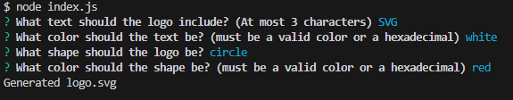
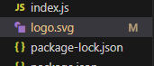
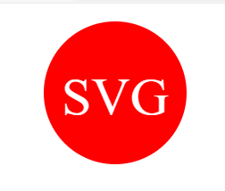

# Logo Generator

## Description

In this challenge, I was tasked with creating a Node.js command line application that takes in user input regarding a logo and generates that logo into an SVG file. The application asks the user three questions: what text to go inside the logo, what color the text should be, what shape the logo should be, and what color the logo should be. 

## Installation

To install my code, I started by installing inquirer and adding a .gitignore file. I then added my files for the shape classes and tests for each shape. To start the actual code, I created an index.js file for my inquirer prompt questions. I then went into my shapes.js file to create the classes for each shape and added three variables into each class that would correlate with the user input. I also created a variable attached to each shape class that generated the proper html for the SVG file. To finish each class, I created a function to write an SVG file with that html from the previous variable. To implement this into my index.js file, I put each class into module exports and required them in index.js. I then used an if statement to create the logos for each shape depending on what the user inputted into the terminal. The last step was to create tests for my shape classes and I did so by making sure the html matched with specific input. 

## Usage

CLick on the link to see a video to see a walk through video of the application https://app.screencastify.com/v3/watch/7T3ZrA31tT5LIwZWBwp4

Once you arrive to the application on the terminal, you will see a prompt asking what text you would like to include on your logo. After submitting that, you will be asked what color you want that text to be. After submtting that, you will be asked what shape you want your logo to be. And finally, after submitting that, you will be asked what color you want your logo to be. After all these prompts have been answered, a message will appear in the terminal saying "Generated logo.svg".

You will then see a new file created called logo.svg with all the code for your logo. 

Upon opening this in your browser, you will see your logo with all your chosen coloring and text. 

